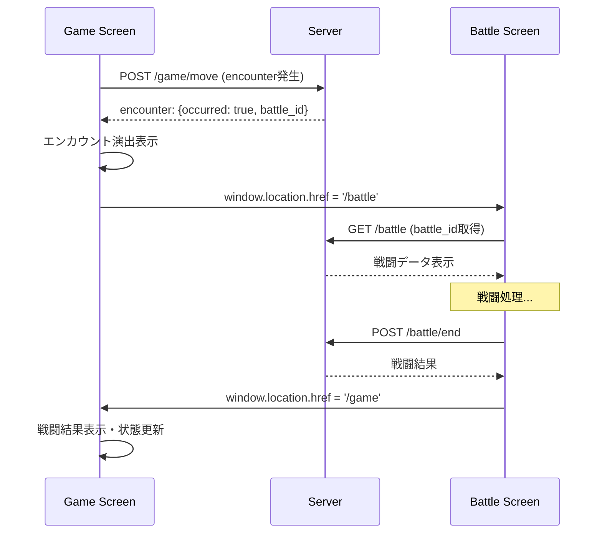
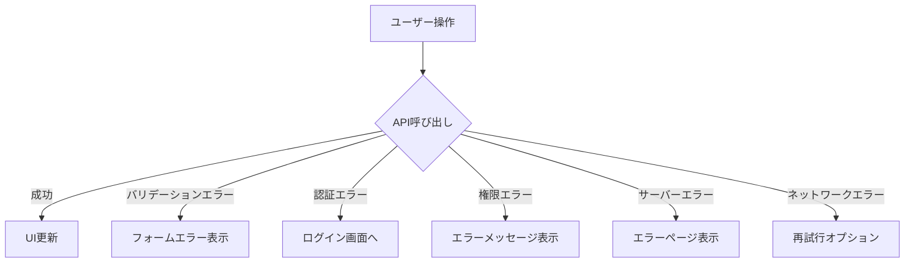

# 画面遷移設計書
# test_smg 画面遷移・UI設計仕様書

## ドキュメント情報

**プロジェクト名**: test_smg (Simple Management Game)  
**作成日**: 2025年7月25日  
**版数**: Version 1.0  
**対象**: フロントエンド開発者、UI/UXデザイナー、QAエンジニア  

---

## 1. 画面遷移設計概要

### 1.1 設計思想

test_smgの画面遷移設計は、以下の原則に基づいて構築されています：

#### 核となる設計原則
1. **単一画面中心**: ページ遷移を最小限に抑えた動的UI更新
2. **直感的フロー**: CGI風の分かりやすい操作感
3. **状態保持**: ゲーム状態の一貫性維持
4. **レスポンシブ**: 全デバイス対応の柔軟な画面設計
5. **アクセシビリティ**: WCAG 2.1 AA準拠の包括的アクセス

### 1.2 画面構成概要

```
test_smg Screen Structure
├── 認証画面群 (Guest Layout)
│   ├── ランディングページ (/)
│   ├── ログイン (/login)
│   ├── 登録 (/register)
│   └── パスワードリセット (/password/reset)
├── ゲーム画面群 (App Layout)
│   ├── ダッシュボード (/dashboard)
│   ├── メインゲーム (/game) ★中心画面
│   ├── 戦闘画面 (/battle)
│   ├── キャラクター管理 (/character)
│   ├── インベントリ (/inventory)
│   ├── 装備管理 (/equipment)
│   ├── スキル管理 (/skills)
│   └── ショップ群 (/shops/*)
└── 管理画面群
    └── プロフィール (/profile)
```

### 1.3 UI更新戦略

#### 画面更新方式
```
Full Page Reload: 認証・初期表示時のみ
├── 認証フロー (login → dashboard → game)
├── エラー復旧 (セッション切れ → login)
└── 初回アクセス (URL直接入力)

Dynamic UI Update: ゲーム内操作の90%
├── AJAX通信 + JavaScript DOM操作
├── 部分的UI更新 (特定コンポーネントのみ)
├── アニメーション・トランジション
└── 状態同期 (サーバー ↔ クライアント)
```

---

## 2. 認証・初期フロー

### 2.1 認証画面遷移

#### ランディング → 登録/ログインフロー
```mermaid
graph TD
    A[/ - ランディングページ] --> B[/register - 新規登録]
    A --> C[/login - ログイン]
    B --> D[自動キャラクター作成]
    C --> E[認証確認]
    D --> F[/dashboard - ダッシュボード]
    E --> F
    F --> G[/game - メインゲーム]
```

#### 画面仕様

##### / (ランディングページ)
```blade
{{-- resources/views/welcome.blade.php --}}
@extends('layouts.guest')

<div class="landing-container">
    <h1>test_smg - Simple Management Game</h1>
    <div class="cta-buttons">
        <a href="/register" class="btn btn-primary">新規登録</a>
        <a href="/login" class="btn btn-secondary">ログイン</a>
    </div>
    <div class="game-preview">
        <p>昔懐かしいCGIゲームの操作感を現代的なUIで体験</p>
    </div>
</div>
```

**UI要素**:
- ゲームロゴ・タイトル
- 新規登録ボタン (Primary CTA)
- ログインボタン (Secondary CTA)  
- ゲーム説明・スクリーンショット

**遷移条件**:
- 未認証ユーザーのみアクセス可能
- 認証済みの場合 → `/dashboard`自動リダイレクト

##### /register (新規登録)
```blade
{{-- resources/views/auth/register.blade.php --}}
@extends('layouts.guest')

<form method="POST" action="{{ route('register') }}">
    @csrf
    <div class="form-group">
        <label for="name">ユーザー名</label>
        <input type="text" name="name" required autofocus>
    </div>
    <div class="form-group">
        <label for="email">メールアドレス</label>
        <input type="email" name="email" required>
    </div>
    <div class="form-group">
        <label for="password">パスワード</label>
        <input type="password" name="password" required>
    </div>
    <div class="form-group">
        <label for="password_confirmation">パスワード確認</label>
        <input type="password" name="password_confirmation" required>
    </div>
    <button type="submit" class="btn btn-primary">アカウント作成</button>
</form>
```

**処理フロー**:
1. フォーム入力・検証
2. `POST /register` → `RegisteredUserController`
3. User作成 + Character自動作成 (Listener)
4. 自動ログイン → `/dashboard`リダイレクト

##### /login (ログイン)
```blade
{{-- resources/views/auth/login.blade.php --}}
@extends('layouts.guest')

<form method="POST" action="{{ route('login') }}">
    @csrf
    <div class="form-group">
        <label for="email">メールアドレス</label>
        <input type="email" name="email" required autofocus>
    </div>
    <div class="form-group">
        <label for="password">パスワード</label>
        <input type="password" name="password" required>
    </div>
    <div class="form-group">
        <input type="checkbox" name="remember" id="remember">
        <label for="remember">ログイン状態を保持</label>
    </div>
    <button type="submit" class="btn btn-primary">ログイン</button>
</form>
```

**処理フロー**:
1. フォーム入力・認証
2. `POST /login` → `AuthenticatedSessionController`
3. セッション作成 → `/dashboard`リダイレクト

### 2.2 認証状態管理

#### 認証ガード
```php
// web.php
Route::middleware(['auth', 'verified'])->group(function () {
    Route::get('/dashboard', function () {
        return view('dashboard');
    })->name('dashboard');
    
    Route::get('/game', [GameController::class, 'index'])->name('game.index');
    // 他のゲーム画面...
});
```

#### セッション切れ対応
```javascript
// resources/js/auth.js
function handleAuthError(response) {
    if (response.status === 401) {
        localStorage.setItem('intended_url', window.location.pathname);
        window.location.href = '/login';
    }
}

// 復帰時の元ページ表示
if (localStorage.getItem('intended_url')) {
    const intendedUrl = localStorage.getItem('intended_url');
    localStorage.removeItem('intended_url');
    window.location.href = intendedUrl;
}
```

---

## 3. メインゲーム画面設計

### 3.1 ゲーム画面構成

#### /game (メインゲーム画面)
**責務**: ゲームの中心となる統合画面

```blade
{{-- resources/views/game/index.blade.php --}}
@extends('layouts.app')

<div class="game-container">
    {{-- ナビゲーション --}}
    @include('game.partials.navigation')
    
    {{-- 場所情報 --}}
    @include('game.partials.location_info')
    
    {{-- 次の場所ボタン --}}
    @include('game.partials.next_location_button')
    
    {{-- サイコロコンテナ --}}
    @include('game.partials.dice_container')
    
    {{-- 移動制御 --}}
    @include('game.partials.movement_controls')
    
    {{-- ゲーム制御 --}}
    @include('game.partials.game_controls')
</div>

<script>
    const gameData = {
        character: @json($character),
        currentLocation: @json($currentLocation),
        nextLocation: @json($nextLocation)
    };
    initializeGame(gameData);
</script>
```

#### UI状態遷移 (町 ↔ 道路)

##### 町 (location_type: 'town')
```html
<!-- 町の表示状態 -->
<div class="location-info town-mode">
    <h2>🏘️ {{ $location.name }}</h2>
    <p>{{ $location.description }}</p>
    
    <!-- 町専用UI -->
    <div class="town-actions">
        <button class="btn btn-primary" onclick="rollDice()">サイコロを振る</button>
        <button class="btn btn-secondary" onclick="showTownMenu()">施設一覧</button>
    </div>
    
    <!-- 次の場所ボタン -->
    <div class="next-location-container" style="display: block;">
        <button class="btn btn-success" onclick="moveToNext()">
            {{ $nextLocation.name }}へ移動
        </button>
    </div>
</div>

<!-- 町メニュー (動的表示) -->
<div class="town-menu" id="town-menu" style="display: none;">
    <h3>施設</h3>
    <div class="facility-buttons">
        <a href="/shops/item" class="btn btn-facility">🛒 アイテムショップ</a>
        <a href="/shops/blacksmith" class="btn btn-facility">⚒️ 鍛冶屋</a>
        <a href="/character" class="btn btn-facility">👤 キャラクター</a>
        <a href="/inventory" class="btn btn-facility">🎒 インベントリ</a>
    </div>
</div>
```

##### 道路 (location_type: 'road')
```html
<!-- 道路の表示状態 -->
<div class="location-info road-mode">
    <h2>🛤️ {{ $location.name }}</h2>
    <p>{{ $location.description }}</p>
    
    <!-- プログレスバー -->
    <div class="progress-bar">
        <div class="progress-fill" style="width: {{ $position }}%"></div>
        <div class="progress-text">{{ $position }}/100</div>
    </div>
    
    <!-- 道路専用UI -->
    <div class="road-actions">
        <button class="btn btn-primary" onclick="rollDice()">サイコロを振る</button>
        <button class="btn btn-secondary" onclick="gatherItems()">採集</button>
    </div>
    
    <!-- 移動制御 -->
    <div class="movement-controls">
        <button class="btn btn-warning" onclick="move('left')" id="move-left">← 戻る</button>
        <span class="current-steps" id="current-steps">移動可能: 0歩</span>
        <button class="btn btn-warning" onclick="move('right')" id="move-right">進む →</button>
    </div>
    
    <!-- 次の場所ボタン (position=0または100で表示) -->
    <div class="next-location-container" id="next-location-container" style="display: none;">
        <button class="btn btn-success" onclick="moveToNext()">
            {{ $nextLocation.name }}へ移動
        </button>
    </div>
</div>
```

### 3.2 動的UI更新システム

#### JavaScript GameManager
```javascript
// public/js/game.js
class GameManager {
    updateGameDisplay(data) {
        const locationType = data.location_type || data.currentLocation?.type;
        
        if (locationType === 'town') {
            this.showTownUI(data);
        } else if (locationType === 'road') {
            this.showRoadUI(data);
        }
        
        this.updateNextLocationDisplay(data.nextLocation, data.canMoveNext);
    }
    
    showTownUI(data) {
        // 町UI表示
        this.hideMovementControls();
        this.hideProgressBar();
        this.showTownMenu();
        this.showNextLocationButton(true);
    }
    
    showRoadUI(data) {
        // 道路UI表示
        this.showMovementControls();
        this.updateProgressBar(data.position || 0);
        this.hideTownMenu();
        
        // 端に到達した場合のみ次の場所ボタン表示
        const canMoveNext = (data.position >= 100 || data.position <= 0);
        this.showNextLocationButton(canMoveNext);
    }
}
```

#### UI遷移アニメーション
```css
/* game.css */
.location-info {
    transition: all 0.3s cubic-bezier(0.4, 0, 0.2, 1);
}

.town-mode {
    background: linear-gradient(135deg, #059669, #10b981);
    color: white;
    transform: translateY(0);
}

.road-mode {
    background: linear-gradient(135deg, #a16207, #d97706);
    color: white;
    transform: translateY(0);
}

.progress-bar {
    transition: all 0.6s cubic-bezier(0.4, 0, 0.2, 1);
    opacity: 0;
}

.road-mode .progress-bar {
    opacity: 1;
}

.fade-in {
    animation: fadeIn 0.3s ease-in-out;
}

@keyframes fadeIn {
    from { opacity: 0; transform: translateY(-10px); }
    to { opacity: 1; transform: translateY(0); }
}
```

---

## 4. 戦闘画面遷移

### 4.1 戦闘開始・終了フロー

#### 戦闘遷移シーケンス


#### /battle (戦闘画面)
```blade
{{-- resources/views/battle/index.blade.php --}}
@extends('layouts.app')

<div class="game-container">
    <div class="battle-card">
        <h1>戦闘</h1>
        <div class="turn-indicator" id="turn-indicator">ターン 1</div>
    </div>
    
    <!-- キャラクター状態 -->
    <div class="character-info">
        <div class="character-name">{{ $character['name'] }}</div>
        <div class="progress hp-bar">
            <div class="progress-fill hp" style="width: {{ ($character['hp'] / $character['max_hp']) * 100 }}%"></div>
            <div class="progress-text">{{ $character['hp'] }}/{{ $character['max_hp'] }}</div>
        </div>
        <div class="progress mp-bar">
            <div class="progress-fill mp" style="width: {{ ($character['mp'] / $character['max_mp']) * 100 }}%"></div>
            <div class="progress-text">{{ $character['mp'] }}/{{ $character['max_mp'] }}</div>
        </div>
    </div>
    
    <!-- モンスター状態 -->
    <div class="monster-info">
        <div class="monster-display">
            <span class="monster-emoji">{{ $monster['emoji'] }}</span>
            <div class="monster-name">{{ $monster['name'] }}</div>
        </div>
        <div class="progress hp-bar">
            <div class="progress-fill monster-hp" style="width: {{ ($monster['hp'] / $monster['max_hp']) * 100 }}%"></div>
            <div class="progress-text">{{ $monster['hp'] }}/{{ $monster['max_hp'] }}</div>
        </div>
    </div>
    
    <!-- 戦闘アクション -->
    <div class="battle-actions">
        <button class="btn btn-danger" onclick="battleAttack()">⚔️ 攻撃</button>
        <button class="btn btn-secondary" onclick="battleDefend()">🛡️ 防御</button>
        <button class="btn btn-info" onclick="battleSkill()">✨ スキル</button>
        <button class="btn btn-warning" onclick="battleEscape()">🏃 逃走</button>
    </div>
    
    <!-- 戦闘ログ -->
    <div class="battle-log" id="battle-log">
        <div class="log-entry">戦闘開始！</div>
    </div>
</div>

<script>
    const battleData = @json($battleData);
    initializeBattle(battleData);
</script>
```

#### 戦闘UI更新
```javascript
// battle.js
class BattleManager {
    performAction(actionType, data = {}) {
        const battleId = this.battleData.battle_id;
        
        fetch(`/battle/${actionType}`, {
            method: 'POST',
            headers: {
                'Content-Type': 'application/json',
                'X-CSRF-TOKEN': document.querySelector('meta[name="csrf-token"]').getAttribute('content')
            },
            body: JSON.stringify({battle_id: battleId, ...data})
        })
        .then(response => response.json())
        .then(data => {
            if (data.success) {
                this.updateBattleDisplay(data.data);
                this.addBattleLog(data.data.messages);
                
                if (data.data.battle_result) {
                    this.handleBattleEnd(data.data.battle_result);
                }
            }
        });
    }
    
    updateBattleDisplay(data) {
        // HP/MP バー更新
        this.updateProgressBar('.character-info .hp', data.character_hp, data.character_max_hp);
        this.updateProgressBar('.character-info .mp', data.character_mp, data.character_max_mp);
        this.updateProgressBar('.monster-info .hp', data.monster_hp, data.monster_max_hp);
        
        // ターン数更新
        document.getElementById('turn-indicator').textContent = `ターン ${data.turn}`;
    }
    
    handleBattleEnd(result) {
        setTimeout(() => {
            if (result.result === 'victory') {
                alert(`勝利！経験値${result.rewards.experience}、金貨${result.rewards.gold}を獲得！`);
            }
            window.location.href = '/game';
        }, 2000);
    }
}
```

---

## 5. 管理画面群

### 5.1 キャラクター・インベントリ画面

#### 画面遷移パターン
```
/game → [施設ボタン] → 各管理画面 → [戻るボタン] → /game
```

#### /character (キャラクター管理)
```blade
{{-- resources/views/character/index.blade.php --}}
@extends('layouts.app')

<div class="character-container">
    <h1>キャラクター情報</h1>
    
    <!-- 基本情報 -->
    <div class="character-card">
        <div class="character-header">
            <h2>{{ $character->name }}</h2>
            <div class="level-badge">Lv.{{ $character->level }}</div>
        </div>
        
        <!-- ステータス表示 -->
        <div class="stats-grid">
            <div class="stat-item">
                <div class="stat-label">攻撃力</div>
                <div class="stat-value">{{ $character->attack }}</div>
            </div>
            <div class="stat-item">
                <div class="stat-label">防御力</div>
                <div class="stat-value">{{ $character->defense }}</div>
            </div>
            <!-- 他のステータス... -->
        </div>
        
        <!-- リソース管理 -->
        <div class="resource-section">
            <div class="resource-item">
                <label>HP</label>
                <div class="progress hp-bar">
                    <div class="progress-fill" style="width: {{ ($character->hp / $character->max_hp) * 100 }}%"></div>
                    <div class="progress-text">{{ $character->hp }}/{{ $character->max_hp }}</div>
                </div>
                <button class="btn btn-sm btn-success" onclick="healHP()">回復</button>
            </div>
            <!-- MP, SP同様... -->
        </div>
    </div>
    
    <!-- アクションボタン -->
    <div class="character-actions">
        <button class="btn btn-danger" onclick="resetCharacter()">ステータスリセット</button>
        <a href="/game" class="btn btn-secondary">ゲームに戻る</a>
    </div>
</div>
```

#### /inventory (インベントリ管理)
```blade
{{-- resources/views/inventory/index.blade.php --}}
@extends('layouts.app')

<div class="inventory-container">
    <h1>インベントリ</h1>
    
    <div class="inventory-info">
        <span>使用中: {{ $inventory['used_slots'] }}/{{ $inventory['max_slots'] }}</span>
        <button class="btn btn-sm btn-primary" onclick="expandSlots()">スロット拡張</button>
    </div>
    
    <!-- インベントリグリッド -->
    <div class="inventory-grid">
        @for ($slot = 0; $slot < $inventory['max_slots']; $slot++)
            <div class="inventory-slot" data-slot="{{ $slot }}" ondrop="dropItem(event)" ondragover="allowDrop(event)">
                @isset($inventory['slots'][$slot])
                    <div class="item" draggable="true" ondragstart="dragItem(event)" data-item-id="{{ $inventory['slots'][$slot]['item']['id'] }}">
                        <div class="item-icon rarity-{{ $inventory['slots'][$slot]['item']['rarity'] }}">
                            {{ $inventory['slots'][$slot]['item']['name'][0] }}
                        </div>
                        <div class="item-quantity">{{ $inventory['slots'][$slot]['quantity'] }}</div>
                        <div class="item-tooltip">
                            <div class="item-name">{{ $inventory['slots'][$slot]['item']['name'] }}</div>
                            <div class="item-description">{{ $inventory['slots'][$slot]['item']['description'] }}</div>
                        </div>
                    </div>
                @endisset
            </div>
        @endfor
    </div>
    
    <!-- アイテム操作 -->
    <div class="item-actions">
        <button class="btn btn-success" onclick="useSelectedItem()">使用</button>
        <button class="btn btn-warning" onclick="sellSelectedItem()">売却</button>
        <button class="btn btn-info" onclick="equipSelectedItem()">装備</button>
    </div>
    
    <div class="navigation-actions">
        <a href="/game" class="btn btn-secondary">ゲームに戻る</a>
    </div>
</div>
```

#### ドラッグ&ドロップ機能
```javascript
// inventory.js
let draggedItem = null;

function dragItem(event) {
    draggedItem = {
        slot: parseInt(event.target.closest('.inventory-slot').dataset.slot),
        itemId: event.target.dataset.itemId
    };
    event.dataTransfer.effectAllowed = 'move';
}

function allowDrop(event) {
    event.preventDefault();
    event.dataTransfer.dropEffect = 'move';
}

function dropItem(event) {
    event.preventDefault();
    const targetSlot = parseInt(event.target.closest('.inventory-slot').dataset.slot);
    
    if (draggedItem && draggedItem.slot !== targetSlot) {
        moveItem(draggedItem.slot, targetSlot);
    }
}

function moveItem(fromSlot, toSlot) {
    fetch('/inventory/move-item', {
        method: 'POST',
        headers: {
            'Content-Type': 'application/json',
            'X-CSRF-TOKEN': document.querySelector('meta[name="csrf-token"]').getAttribute('content')
        },
        body: JSON.stringify({
            from_slot: fromSlot,
            to_slot: toSlot,
            quantity: 1
        })
    })
    .then(response => response.json())
    .then(data => {
        if (data.success) {
            location.reload(); // または部分更新
        } else {
            alert(data.error.message);
        }
    });
}
```

### 5.2 ショップ画面

#### ショップ選択フロー
```
/game → [施設一覧] → /shops/item or /shops/blacksmith → [購入/売却] → /game
```

#### /shops/item (アイテムショップ)
```blade
{{-- resources/views/shops/item/index.blade.php --}}
@extends('layouts.app')

<div class="shop-container">
    <div class="shop-header">
        <h1>🛒 {{ $shop['name'] }}</h1>
        <p>{{ $shop['description'] }}</p>
        <div class="player-gold">所持金: {{ number_format($playerGold) }}G</div>
    </div>
    
    <!-- 商品一覧 -->
    <div class="shop-items">
        @foreach ($items as $item)
            <div class="shop-item" data-item-id="{{ $item['id'] }}">
                <div class="item-info">
                    <div class="item-name rarity-{{ $item['rarity'] }}">{{ $item['name'] }}</div>
                    <div class="item-description">{{ $item['description'] }}</div>
                    <div class="item-effects">
                        @if ($item['effects'])
                            効果: {{ implode(', ', array_map(fn($k, $v) => "$k +$v", array_keys($item['effects']), $item['effects'])) }}
                        @endif
                    </div>
                </div>
                <div class="item-purchase">
                    <div class="item-price">{{ number_format($item['price']) }}G</div>
                    <div class="item-stock">
                        @if ($item['stock'] === -1)
                            在庫: 無限
                        @else
                            在庫: {{ $item['stock'] }}個
                        @endif
                    </div>
                    <div class="purchase-controls">
                        <input type="number" class="quantity-input" value="1" min="1" max="{{ $item['stock'] === -1 ? 99 : $item['stock'] }}">
                        <button class="btn btn-success" onclick="purchaseItem({{ $item['id'] }})">購入</button>
                    </div>
                </div>
            </div>
        @endforeach
    </div>
    
    <!-- 売却セクション -->
    <div class="sell-section">
        <h2>アイテム売却</h2>
        <div class="player-inventory-preview">
            <!-- プレイヤーインベントリのプレビュー -->
        </div>
    </div>
    
    <div class="shop-actions">
        <a href="/game" class="btn btn-secondary">店を出る</a>
    </div>
</div>
```

#### ショップ取引処理
```javascript
// shop.js
function purchaseItem(itemId) {
    const quantity = document.querySelector(`[data-item-id="${itemId}"] .quantity-input`).value;
    
    fetch(`/shops/${currentShopId}/buy`, {
        method: 'POST',
        headers: {
            'Content-Type': 'application/json',
            'X-CSRF-TOKEN': document.querySelector('meta[name="csrf-token"]').getAttribute('content')
        },
        body: JSON.stringify({
            item_id: itemId,
            quantity: parseInt(quantity)
        })
    })
    .then(response => response.json())
    .then(data => {
        if (data.success) {
            showPurchaseSuccess(data.data);
            updatePlayerGold(data.data.player_state.new_gold);
            updateItemStock(itemId, data.data.remaining_stock);
        } else {
            showError(data.error.message);
        }
    });
}

function showPurchaseSuccess(purchaseData) {
    const message = `${purchaseData.purchase.item_name}を${purchaseData.purchase.quantity}個購入しました！`;
    showNotification(message, 'success');
}
```

---

## 6. エラー処理・UX設計

### 6.1 エラー画面遷移

#### エラーハンドリングフロー


#### エラー表示コンポーネント
```javascript
// error-handler.js
class ErrorHandler {
    static showError(message, type = 'error') {
        const notification = document.createElement('div');
        notification.className = `notification notification-${type}`;
        notification.innerHTML = `
            <div class="notification-content">
                <span class="notification-message">${message}</span>
                <button class="notification-close" onclick="this.parentElement.parentElement.remove()">×</button>
            </div>
        `;
        
        document.body.appendChild(notification);
        
        // 5秒後自動削除
        setTimeout(() => {
            if (notification.parentElement) {
                notification.remove();
            }
        }, 5000);
    }
    
    static handleApiError(error, context = '') {
        if (error.status === 401) {
            this.showError('セッションが切れました。再ログインしてください。');
            setTimeout(() => window.location.href = '/login', 2000);
        } else if (error.status === 403) {
            this.showError('この操作を実行する権限がありません。');
        } else if (error.status === 422) {
            this.showValidationErrors(error.errors);
        } else if (error.status >= 500) {
            this.showError('サーバーエラーが発生しました。しばらく待ってから再試行してください。');
        } else {
            this.showError(`${context}中にエラーが発生しました。`);
        }
    }
}
```

### 6.2 Loading・フィードバック

#### Loading状態表示
```css
/* loading.css */
.loading-overlay {
    position: fixed;
    top: 0;
    left: 0;
    width: 100%;
    height: 100%;
    background: rgba(0, 0, 0, 0.3);
    display: flex;
    justify-content: center;
    align-items: center;
    z-index: 1000;
}

.loading-spinner {
    width: 40px;
    height: 40px;
    border: 4px solid #e2e8f0;
    border-top: 4px solid #0f172a;
    border-radius: 50%;
    animation: spin 1s linear infinite;
}

@keyframes spin {
    0% { transform: rotate(0deg); }
    100% { transform: rotate(360deg); }
}
```

```javascript
// loading.js
class LoadingManager {
    static show(message = 'Loading...') {
        const overlay = document.createElement('div');
        overlay.id = 'loading-overlay';
        overlay.className = 'loading-overlay';
        overlay.innerHTML = `
            <div class="loading-content">
                <div class="loading-spinner"></div>
                <div class="loading-message">${message}</div>
            </div>
        `;
        document.body.appendChild(overlay);
    }
    
    static hide() {
        const overlay = document.getElementById('loading-overlay');
        if (overlay) overlay.remove();
    }
}

// AJAX操作時の自動Loading
function apiCall(url, options, loadingMessage = 'Processing...') {
    LoadingManager.show(loadingMessage);
    
    return fetch(url, options)
        .then(response => {
            LoadingManager.hide();
            return response;
        })
        .catch(error => {
            LoadingManager.hide();
            throw error;
        });
}
```

---

## 7. モバイル・レスポンシブ対応

### 7.1 ブレークポイント設計

#### レスポンシブ戦略
```css
/* responsive.css */

/* スマートフォン (375px以下) */
@media (max-width: 23.4375em) {
    .game-container {
        padding: 0.5rem;
    }
    
    .button-group {
        flex-direction: column;
        align-items: stretch;
    }
    
    .button-group .btn {
        margin-bottom: 0.5rem;
        width: 100%;
    }
    
    .inventory-grid {
        grid-template-columns: repeat(4, 1fr);
        gap: 0.25rem;
    }
    
    .shop-item {
        flex-direction: column;
        padding: 1rem;
    }
}

/* タブレット (744px以下) */
@media (max-width: 46.5em) {
    .battle-actions {
        grid-template-columns: repeat(2, 1fr);
        gap: 1rem;
    }
    
    .character-info, .monster-info {
        padding: 1rem;
    }
    
    .inventory-grid {
        grid-template-columns: repeat(6, 1fr);
    }
}

/* デスクトップ (1024px以上) */
@media (min-width: 64em) {
    .game-container {
        max-width: 1200px;
        margin: 0 auto;
    }
    
    .battle-layout {
        display: grid;
        grid-template-columns: 1fr 1fr;
        gap: 2rem;
    }
    
    .inventory-grid {
        grid-template-columns: repeat(10, 1fr);
    }
}
```

### 7.2 タッチ操作対応

#### タッチインタラクション
```javascript
// touch.js
class TouchHandler {
    constructor() {
        this.setupTouchEvents();
    }
    
    setupTouchEvents() {
        // ダブルタップでアイテム使用
        document.addEventListener('touchend', this.handleDoubleTap.bind(this));
        
        // 長押しでコンテキストメニュー
        document.addEventListener('touchstart', this.handleLongPress.bind(this));
        
        // スワイプジェスチャー
        document.addEventListener('touchstart', this.handleSwipeStart.bind(this));
        document.addEventListener('touchend', this.handleSwipeEnd.bind(this));
    }
    
    handleDoubleTap(event) {
        const now = Date.now();
        const lastTap = this.lastTap || 0;
        
        if (now - lastTap < 300) {
            const target = event.target.closest('.inventory-slot .item');
            if (target) {
                this.useItem(target.dataset.itemId);
            }
        }
        
        this.lastTap = now;
    }
    
    handleLongPress(event) {
        this.longPressTimer = setTimeout(() => {
            const target = event.target.closest('.inventory-slot .item');
            if (target) {
                this.showContextMenu(target, event.touches[0]);
            }
        }, 500);
    }
}
```

---

## 8. パフォーマンス・UX最適化

### 8.1 画面読み込み最適化

#### Critical Rendering Path
```html
<!-- 優先度高 (Above the fold) -->
<link rel="preload" href="/css/game-design-system.css" as="style">
<link rel="preload" href="/js/game.js" as="script">

<!-- 遅延読み込み (Below the fold) -->
<link rel="prefetch" href="/css/battle.css">
<link rel="prefetch" href="/js/inventory.js">
```

#### 段階的機能読み込み
```javascript
// lazy-loading.js
class LazyLoader {
    static loadBattleAssets() {
        return Promise.all([
            this.loadCSS('/css/battle.css'),
            this.loadScript('/js/battle.js')
        ]);
    }
    
    static loadCSS(href) {
        return new Promise((resolve) => {
            if (document.querySelector(`link[href="${href}"]`)) {
                resolve();
                return;
            }
            
            const link = document.createElement('link');
            link.rel = 'stylesheet';
            link.href = href;
            link.onload = resolve;
            document.head.appendChild(link);
        });
    }
    
    static loadScript(src) {
        return new Promise((resolve) => {
            if (document.querySelector(`script[src="${src}"]`)) {
                resolve();
                return;
            }
            
            const script = document.createElement('script');
            script.src = src;
            script.onload = resolve;
            document.head.appendChild(script);
        });
    }
}

// 戦闘開始時の動的読み込み
function startBattle(battleId) {
    LoadingManager.show('戦闘準備中...');
    
    LazyLoader.loadBattleAssets()
        .then(() => {
            window.location.href = '/battle';
        });
}
```

### 8.2 UX改善施策

#### プログレッシブエンハンスメント
```javascript
// progressive-enhancement.js
class ProgressiveEnhancement {
    static init() {
        // 基本機能から開始
        this.enableBasicNavigation();
        
        // JavaScript有効時の拡張機能
        if (this.isJavaScriptEnabled()) {
            this.enableAjaxNavigation();
            this.enableRealTimeUpdates();
            this.enableAnimations();
        }
    }
    
    static enableBasicNavigation() {
        // フォームベースの基本操作
        document.querySelectorAll('form[data-ajax]').forEach(form => {
            form.addEventListener('submit', this.handleFormSubmit);
        });
    }
    
    static enableAjaxNavigation() {
        // AJAX による動的更新
        document.querySelectorAll('a[data-ajax]').forEach(link => {
            link.addEventListener('click', this.handleAjaxClick);
        });
    }
}
```

#### アクセシビリティ対応
```html
<!-- ARIA属性 -->
<div role="application" aria-label="ゲームメイン画面">
    <nav role="navigation" aria-label="ゲーム機能メニュー">
        <button aria-describedby="dice-help">サイコロを振る</button>
        <div id="dice-help" class="sr-only">サイコロを振って移動距離を決定します</div>
    </nav>
    
    <main role="main">
        <div role="region" aria-label="ゲーム状態" aria-live="polite">
            <div id="game-status">町にいます</div>
        </div>
        
        <div role="region" aria-label="ゲーム操作">
            <button aria-pressed="false" aria-describedby="move-help">移動</button>
        </div>
    </main>
</div>

<!-- スクリーンリーダー対応 -->
<div class="sr-only" aria-live="assertive" id="screen-reader-announcements"></div>
```

```javascript
// accessibility.js
class AccessibilityManager {
    static announceToScreenReader(message) {
        const announcer = document.getElementById('screen-reader-announcements');
        announcer.textContent = message;
        
        // 少し遅らせてクリア
        setTimeout(() => {
            announcer.textContent = '';
        }, 1000);
    }
    
    static updateGameStatus(status) {
        document.getElementById('game-status').textContent = status;
        this.announceToScreenReader(status);
    }
}
```

---

このような画面遷移設計により、test_smgは直感的で使いやすく、全デバイス・全ユーザーに対応した包括的なUI/UXを提供し、CGI風のシンプルさと現代的な使いやすさを両立した優れたゲーム体験を実現しています。

**最終更新**: 2025年7月25日  
**次回レビュー**: UI/UX変更時または新機能追加時