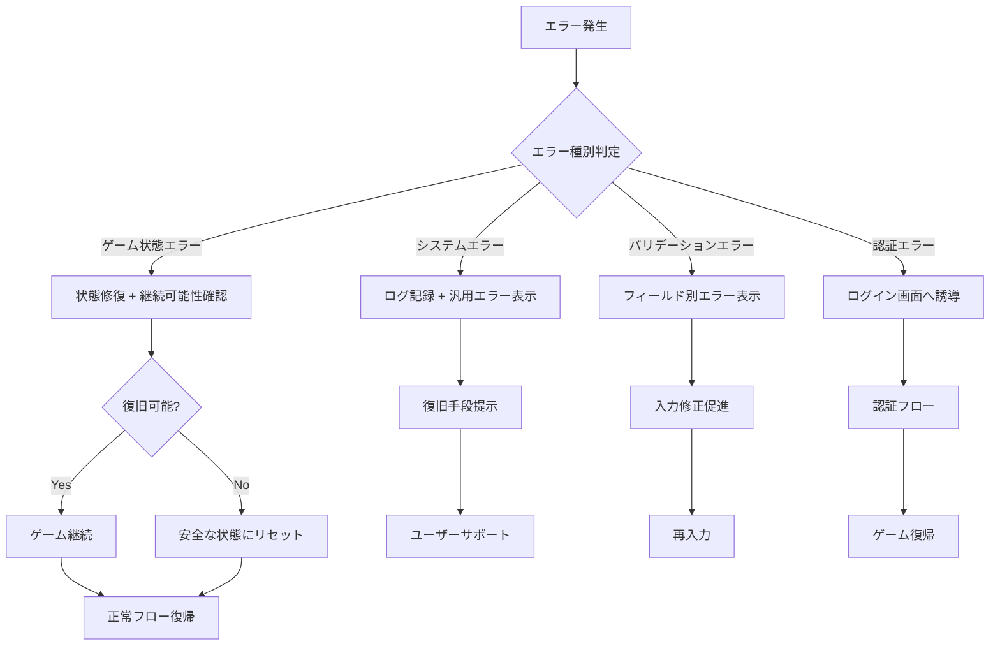

# エラーハンドリング設計書
# test_smg エラー処理・例外管理仕様書

## ドキュメント情報

**プロジェクト名**: test_smg (Simple Management Game)  
**作成日**: 2025年7月25日  
**版数**: Version 1.0  
**対象**: 開発チーム、QAエンジニア、サポート担当者  

---

## 1. エラーハンドリング設計概要

### 1.1 設計思想

test_smgのエラーハンドリング設計は、以下の原則に基づいて構築されています：

#### 核となる設計原則
1. **ユーザー体験優先**: 分かりやすいエラーメッセージとリカバリー手段の提供
2. **段階的処理**: 予防→検出→復旧→学習のサイクル
3. **開発者支援**: 詳細なログとデバッグ情報の記録
4. **セキュリティ**: 機密情報の漏洩防止
5. **ゲーム継続性**: エラー発生時もゲーム進行を可能な限り維持

### 1.2 エラー分類体系

```
test_smg Error Classification
├── システムエラー (System Errors)
│   ├── Infrastructure Errors (500-599)
│   ├── Database Errors
│   └── Network Errors
├── アプリケーションエラー (Application Errors)
│   ├── Validation Errors (422)
│   ├── Business Logic Errors (400)
│   └── Game State Errors
├── 認証・認可エラー (Auth Errors)
│   ├── Authentication Errors (401)
│   ├── Authorization Errors (403)
│   └── Session Errors
├── クライアントエラー (Client Errors)
│   ├── JavaScript Errors
│   ├── Network Connection Errors
│   └── Browser Compatibility Errors
└── ゲーム固有エラー (Game-specific Errors)
    ├── Resource Insufficient Errors
    ├── Battle State Errors
    └── Inventory Errors
```

### 1.3 エラー処理フロー



---

## 2. サーバーサイド エラーハンドリング

### 2.1 Laravel例外処理基盤

#### Exception Handler
```php
<?php
// app/Exceptions/Handler.php

namespace App\Exceptions;

use Illuminate\Foundation\Exceptions\Handler as ExceptionHandler;
use Illuminate\Http\Request;
use Illuminate\Http\Response;
use Illuminate\Validation\ValidationException;
use Illuminate\Auth\AuthenticationException;
use Illuminate\Database\Eloquent\ModelNotFoundException;
use Throwable;

class Handler extends ExceptionHandler
{
    /**
     * 報告しない例外タイプ
     */
    protected $dontReport = [
        ValidationException::class,
        AuthenticationException::class,
        GameStateException::class, // ゲーム固有の予期されるエラー
    ];

    /**
     * レスポンスに含めない属性
     */
    protected $dontFlash = [
        'current_password',
        'password',
        'password_confirmation',
    ];

    /**
     * 例外の報告処理
     */
    public function report(Throwable $exception): void
    {
        // ゲーム固有のエラー報告
        if ($exception instanceof GameCriticalException) {
            $this->reportGameCriticalError($exception);
        }

        parent::report($exception);
    }

    /**
     * HTTPレスポンスへの例外変換
     */
    public function render($request, Throwable $exception): Response
    {
        // AJAX リクエストの場合は JSON レスポンス
        if ($request->expectsJson()) {
            return $this->renderJsonError($request, $exception);
        }

        // ゲーム固有の例外処理
        if ($exception instanceof GameException) {
            return $this->renderGameError($request, $exception);
        }

        return parent::render($request, $exception);
    }

    /**
     * JSON エラーレスポンス生成
     */
    private function renderJsonError(Request $request, Throwable $exception): Response
    {
        $statusCode = $this->getStatusCode($exception);
        $errorData = $this->buildErrorData($exception);

        return response()->json([
            'success' => false,
            'error' => $errorData,
            'timestamp' => now()->toISOString()
        ], $statusCode);
    }

    /**
     * エラーデータ構築
     */
    private function buildErrorData(Throwable $exception): array
    {
        $errorCode = $this->getErrorCode($exception);
        $message = $this->getUserFriendlyMessage($exception);
        
        $errorData = [
            'code' => $errorCode,
            'message' => $message,
        ];

        // 開発環境でのみ詳細情報を含める
        if (app()->hasDebugModeEnabled()) {
            $errorData['debug'] = [
                'exception' => get_class($exception),
                'file' => $exception->getFile(),
                'line' => $exception->getLine(),
                'trace' => $exception->getTraceAsString()
            ];
        }

        // バリデーションエラーの詳細
        if ($exception instanceof ValidationException) {
            $errorData['details'] = $exception->errors();
        }

        return $errorData;
    }
}
```

### 2.2 ゲーム固有例外クラス

#### カスタム例外階層
```php
<?php
// app/Exceptions/GameException.php

namespace App\Exceptions;

use Exception;

abstract class GameException extends Exception
{
    protected string $errorCode = 'GAME_ERROR';
    protected string $userMessage = 'ゲーム処理中にエラーが発生しました';
    protected array $context = [];

    public function __construct(string $message = '', array $context = [], int $code = 0, ?Throwable $previous = null)
    {
        $this->context = $context;
        parent::__construct($message ?: $this->userMessage, $code, $previous);
    }

    public function getErrorCode(): string
    {
        return $this->errorCode;
    }

    public function getUserMessage(): string
    {
        return $this->userMessage;
    }

    public function getContext(): array
    {
        return $this->context;
    }
}

// 具体的な例外クラス
class InsufficientResourcesException extends GameException
{
    protected string $errorCode = 'INSUFFICIENT_RESOURCES';
    protected string $userMessage = 'リソースが不足しています';
}

class InvalidGameStateException extends GameException
{
    protected string $errorCode = 'INVALID_GAME_STATE';
    protected string $userMessage = 'この状態では実行できません';
}

class BattleException extends GameException
{
    protected string $errorCode = 'BATTLE_ERROR';
    protected string $userMessage = '戦闘処理中にエラーが発生しました';
}

class InventoryFullException extends GameException
{
    protected string $errorCode = 'INVENTORY_FULL';
    protected string $userMessage = 'インベントリがいっぱいです';
}

class CheatDetectedException extends GameException
{
    protected string $errorCode = 'CHEAT_DETECTED';
    protected string $userMessage = '不正な操作が検出されました';
}
```

### 2.3 Controller レベルのエラー処理

#### 統一エラーレスポンスTrait
```php
<?php
// app/Http/Controllers/Traits/HandlesApiErrors.php

namespace App\Http\Controllers\Traits;

use App\Exceptions\GameException;
use Illuminate\Http\JsonResponse;
use Illuminate\Http\Request;
use Illuminate\Support\Facades\Log;
use Throwable;

trait HandlesApiErrors
{
    /**
     * API 成功レスポンス
     */
    protected function successResponse($data = [], string $message = 'Success'): JsonResponse
    {
        return response()->json([
            'success' => true,
            'data' => $data,
            'message' => $message,
            'timestamp' => now()->toISOString()
        ]);
    }

    /**
     * API エラーレスポンス
     */
    protected function errorResponse(string $errorCode, string $message, array $details = [], int $statusCode = 400): JsonResponse
    {
        return response()->json([
            'success' => false,
            'error' => [
                'code' => $errorCode,
                'message' => $message,
                'details' => $details
            ],
            'timestamp' => now()->toISOString()
        ], $statusCode);
    }

    /**
     * 例外から API エラーレスポンス生成
     */
    protected function exceptionResponse(Throwable $exception): JsonResponse
    {
        if ($exception instanceof GameException) {
            return $this->errorResponse(
                $exception->getErrorCode(),
                $exception->getUserMessage(),
                $exception->getContext()
            );
        }

        // 予期しない例外の場合
        Log::error('Unexpected exception in API', [
            'exception' => get_class($exception),
            'message' => $exception->getMessage(),
            'file' => $exception->getFile(),
            'line' => $exception->getLine(),
            'user_id' => auth()->id(),
            'url' => request()->fullUrl(),
            'input' => request()->all()
        ]);

        return $this->errorResponse(
            'SERVER_ERROR',
            'サーバー内部エラーが発生しました',
            [],
            500
        );
    }

    /**
     * try-catch wrapper for API endpoints
     */
    protected function handleApiOperation(callable $operation): JsonResponse
    {
        try {
            $result = $operation();
            return $this->successResponse($result);
        } catch (GameException $e) {
            Log::info('Game exception caught', [
                'code' => $e->getErrorCode(),
                'message' => $e->getMessage(),
                'context' => $e->getContext(),
                'user_id' => auth()->id()
            ]);
            return $this->exceptionResponse($e);
        } catch (Throwable $e) {
            return $this->exceptionResponse($e);
        }
    }
}
```

#### Controller実装例
```php
<?php
// app/Http/Controllers/GameController.php (エラーハンドリング追加版)

namespace App\Http\Controllers;

use App\Http\Controllers\Traits\HandlesApiErrors;
use App\Http\Controllers\Traits\HasCharacter;
use App\Application\Services\GameStateManager;
use Illuminate\Http\Request;
use Illuminate\Http\JsonResponse;

class GameController extends Controller
{
    use HasCharacter, HandlesApiErrors;

    public function __construct(
        private readonly GameStateManager $gameStateManager
    ) {}

    public function rollDice(Request $request): JsonResponse
    {
        return $this->handleApiOperation(function () {
            $character = $this->getOrCreateCharacter();
            
            // SP チェック
            if ($character->sp < 2) {
                throw new InsufficientResourcesException(
                    'SP不足でサイコロを振れません',
                    ['required' => 2, 'available' => $character->sp]
                );
            }

            $diceResult = $this->gameStateManager->rollDice($character);
            return $diceResult->toArray();
        });
    }

    public function move(Request $request): JsonResponse
    {
        return $this->handleApiOperation(function () use ($request) {
            $request->validate([
                'direction' => 'required|in:left,right',
                'steps' => 'required|integer|min:1|max:30'
            ]);

            $character = $this->getOrCreateCharacter();
            
            // ゲーム状態チェック
            if ($character->location_type !== 'road') {
                throw new InvalidGameStateException(
                    '道路上でないと移動できません',
                    ['current_location' => $character->location_type]
                );
            }

            $moveResult = $this->gameStateManager->moveCharacter($character, $request);
            return $moveResult->toArray();
        });
    }
}
```

### 2.4 データベースエラー処理

#### Query Exception 処理
```php
<?php
// app/Services/DatabaseErrorHandler.php

namespace App\Services;

use Illuminate\Database\QueryException;
use Illuminate\Database\UniqueConstraintViolationException;
use Illuminate\Support\Facades\Log;
use Throwable;

class DatabaseErrorHandler
{
    /**
     * データベースエラーをゲーム例外に変換
     */
    public static function handleDatabaseError(Throwable $exception, string $operation = 'database operation'): never
    {
        Log::error("Database error during {$operation}", [
            'exception' => get_class($exception),
            'message' => $exception->getMessage(),
            'sql' => $exception instanceof QueryException ? $exception->getSql() : null,
            'bindings' => $exception instanceof QueryException ? $exception->getBindings() : null
        ]);

        // 具体的なエラー種別の判定
        if ($exception instanceof UniqueConstraintViolationException) {
            throw new GameException('データの重複エラーが発生しました');
        }

        if ($exception instanceof QueryException) {
            $errorCode = $exception->getCode();
            
            // MySQL固有のエラーコード
            switch ($errorCode) {
                case '23000': // 整合性制約違反
                    throw new GameException('データ整合性エラーが発生しました');
                case '42S02': // テーブルが存在しない
                    throw new GameException('システムエラーが発生しました');
                default:
                    throw new GameException('データベースエラーが発生しました');
            }
        }

        throw new GameException('データ処理中にエラーが発生しました');
    }

    /**
     * 安全なクエリ実行wrapper
     */
    public static function safeQuery(callable $query, string $operation = 'query')
    {
        try {
            return $query();
        } catch (Throwable $e) {
            self::handleDatabaseError($e, $operation);
        }
    }
}

// 使用例
class CharacterStatsService
{
    public function updateCharacterLevel(Character $character): bool
    {
        return DatabaseErrorHandler::safeQuery(function () use ($character) {
            $newLevel = $this->calculateCharacterLevel($character);
            return $character->update(['level' => $newLevel]);
        }, 'character level update');
    }
}
```

---

## 3. クライアントサイド エラーハンドリング

### 3.1 JavaScript エラー処理基盤

#### グローバルエラーハンドラー
```javascript
// public/js/error-handler.js

class ErrorHandler {
    static init() {
        // 未処理例外のキャッチ
        window.addEventListener('error', this.handleGlobalError.bind(this));
        
        // Promise の未処理 rejection
        window.addEventListener('unhandledrejection', this.handleUnhandledRejection.bind(this));
        
        // AJAX エラーの統一処理
        this.setupAjaxErrorHandler();
    }

    static handleGlobalError(event) {
        console.error('Global error caught:', event.error);
        
        const errorInfo = {
            message: event.error?.message || 'Unknown error',
            filename: event.filename,
            lineno: event.lineno,
            colno: event.colno,
            stack: event.error?.stack,
            userAgent: navigator.userAgent,
            url: window.location.href,
            timestamp: new Date().toISOString()
        };

        // サーバーへエラー報告
        this.reportErrorToServer(errorInfo);
        
        // ユーザーへの通知
        this.showUserFriendlyError('予期しないエラーが発生しました。ページを再読み込みしてください。');
    }

    static handleUnhandledRejection(event) {
        console.error('Unhandled promise rejection:', event.reason);
        
        // Promise rejection を防ぐ
        event.preventDefault();
        
        const errorInfo = {
            type: 'unhandled_promise_rejection',
            reason: event.reason?.toString() || 'Unknown rejection',
            url: window.location.href,
            timestamp: new Date().toISOString()
        };

        this.reportErrorToServer(errorInfo);
        this.showUserFriendlyError('通信エラーが発生しました。');
    }

    static setupAjaxErrorHandler() {
        // fetch のエラーハンドリング強化
        const originalFetch = window.fetch;
        window.fetch = function(...args) {
            return originalFetch.apply(this, args)
                .then(response => {
                    if (!response.ok) {
                        throw new NetworkError(`HTTP ${response.status}: ${response.statusText}`, response);
                    }
                    return response;
                })
                .catch(error => {
                    ErrorHandler.handleFetchError(error, args[0]);
                    throw error;
                });
        };
    }

    static handleFetchError(error, url) {
        console.error('Fetch error:', error);
        
        if (error instanceof NetworkError) {
            if (error.response?.status === 401) {
                this.handleAuthenticationError();
                return;
            }
            if (error.response?.status === 403) {
                this.showUserFriendlyError('この操作を実行する権限がありません。');
                return;
            }
            if (error.response?.status >= 500) {
                this.showUserFriendlyError('サーバーエラーが発生しました。しばらく待ってから再試行してください。');
                return;
            }
        }

        this.showUserFriendlyError('通信エラーが発生しました。ネットワーク接続を確認してください。');
    }

    static handleAuthenticationError() {
        this.showUserFriendlyError('セッションが切れました。ログイン画面に移動します。');
        
        // 現在のURLを保存して、ログイン後に復帰
        localStorage.setItem('intended_url', window.location.pathname);
        
        setTimeout(() => {
            window.location.href = '/login';
        }, 2000);
    }

    static reportErrorToServer(errorInfo) {
        // エラー報告のための通信エラーは無視
        fetch('/api/error-report', {
            method: 'POST',
            headers: {
                'Content-Type': 'application/json',
                'X-CSRF-TOKEN': document.querySelector('meta[name="csrf-token"]')?.getAttribute('content')
            },
            body: JSON.stringify(errorInfo)
        }).catch(() => {
            // エラー報告の失敗は無視（無限ループ防止）
        });
    }

    static showUserFriendlyError(message, type = 'error') {
        NotificationManager.show(message, type);
    }
}

// カスタムエラークラス
class NetworkError extends Error {
    constructor(message, response) {
        super(message);
        this.name = 'NetworkError';
        this.response = response;
    }
}

class GameStateError extends Error {
    constructor(message, gameState) {
        super(message);
        this.name = 'GameStateError';
        this.gameState = gameState;
    }
}

// 初期化
document.addEventListener('DOMContentLoaded', () => {
    ErrorHandler.init();
});
```

### 3.2 API呼び出し エラーハンドリング

#### 統一API Client
```javascript
// public/js/api-client.js

class ApiClient {
    static async request(url, options = {}) {
        const defaultOptions = {
            headers: {
                'Content-Type': 'application/json',
                'Accept': 'application/json',
                'X-Requested-With': 'XMLHttpRequest',
                'X-CSRF-TOKEN': document.querySelector('meta[name="csrf-token"]')?.getAttribute('content')
            }
        };

        const mergedOptions = {
            ...defaultOptions,
            ...options,
            headers: { ...defaultOptions.headers, ...options.headers }
        };

        try {
            const response = await fetch(url, mergedOptions);
            const data = await response.json();

            if (!data.success) {
                throw new ApiError(data.error.code, data.error.message, data.error.details, response.status);
            }

            return data.data;
        } catch (error) {
            if (error instanceof ApiError) {
                throw error;
            }
            
            // ネットワークエラーやその他の例外
            throw new ApiError('NETWORK_ERROR', 'ネットワークエラーが発生しました', {}, 0);
        }
    }

    static async get(url, params = {}) {
        const urlWithParams = new URL(url, window.location.origin);
        Object.keys(params).forEach(key => urlWithParams.searchParams.append(key, params[key]));
        
        return this.request(urlWithParams.toString());
    }

    static async post(url, data = {}) {
        return this.request(url, {
            method: 'POST',
            body: JSON.stringify(data)
        });
    }

    static async put(url, data = {}) {
        return this.request(url, {
            method: 'PUT',
            body: JSON.stringify(data)
        });
    }

    static async delete(url) {
        return this.request(url, {
            method: 'DELETE'
        });
    }
}

class ApiError extends Error {
    constructor(code, message, details = {}, status = 400) {
        super(message);
        this.name = 'ApiError';
        this.code = code;
        this.details = details;
        this.status = status;
    }

    isValidationError() {
        return this.code === 'VALIDATION_ERROR';
    }

    isAuthenticationError() {
        return this.code === 'AUTHENTICATION_ERROR';
    }

    isGameStateError() {
        return this.code.includes('GAME_STATE') || this.code.includes('INVALID_');
    }

    isResourceError() {
        return this.code === 'INSUFFICIENT_RESOURCES';
    }
}
```

### 3.3 ゲーム固有エラー処理

#### ゲーム操作エラーハンドリング
```javascript
// public/js/game-error-handler.js

class GameErrorHandler {
    static handleGameAction(actionName, apiCall) {
        return apiCall
            .then(result => {
                this.showActionSuccess(actionName, result);
                return result;
            })
            .catch(error => {
                this.handleGameError(actionName, error);
                throw error;
            });
    }

    static handleGameError(actionName, error) {
        if (!(error instanceof ApiError)) {
            this.showGenericError(actionName);
            return;
        }

        switch (error.code) {
            case 'INSUFFICIENT_RESOURCES':
                this.handleResourceError(actionName, error);
                break;
            
            case 'INVALID_GAME_STATE':
                this.handleGameStateError(actionName, error);
                break;
            
            case 'INVENTORY_FULL':
                this.handleInventoryFullError(error);
                break;
            
            case 'BATTLE_ERROR':
                this.handleBattleError(error);
                break;
            
            case 'VALIDATION_ERROR':
                this.handleValidationError(error);
                break;
            
            case 'AUTHENTICATION_ERROR':
                ErrorHandler.handleAuthenticationError();
                break;
            
            default:
                this.showGenericError(actionName, error.message);
        }
    }

    static handleResourceError(actionName, error) {
        const resource = error.details.resource_type || 'リソース';
        const required = error.details.required || '不明';
        const available = error.details.available || '不明';
        
        NotificationManager.show(
            `${resource}が不足しています（必要: ${required}, 所持: ${available}）`,
            'warning'
        );
        
        // リソース回復の提案
        this.suggestResourceRecovery(resource);
    }

    static handleGameStateError(actionName, error) {
        const currentState = error.details.current_state;
        const requiredState = error.details.required_state;
        
        let message = `この状態では${actionName}できません。`;
        if (requiredState) {
            message += `（${requiredState}にいる必要があります）`;
        }
        
        NotificationManager.show(message, 'warning');
        
        // 状態修復の提案
        this.suggestStateCorrection(currentState, requiredState);
    }

    static handleInventoryFullError(error) {
        NotificationManager.show(
            'インベントリがいっぱいです。不要なアイテムを整理してください。',
            'warning'
        );
        
        // インベントリ画面への誘導
        this.showInventoryManagementOption();
    }

    static handleBattleError(error) {
        NotificationManager.show(
            '戦闘処理中にエラーが発生しました。戦闘を再開します。',
            'error'
        );
        
        // 戦闘状態の復旧
        this.recoverBattleState();
    }

    static handleValidationError(error) {
        const details = error.details;
        Object.keys(details).forEach(field => {
            const fieldElement = document.querySelector(`[name="${field}"]`);
            if (fieldElement) {
                this.showFieldError(fieldElement, details[field][0]);
            }
        });
    }

    static suggestResourceRecovery(resourceType) {
        const suggestions = {
            'sp': '時間の経過またはアイテム使用でSPを回復できます。',
            'hp': 'ポーションまたは宿屋でHPを回復できます。',
            'mp': 'マジックポーションでMPを回復できます。',
            'gold': 'アイテム売却や戦闘で金貨を獲得できます。'
        };
        
        const suggestion = suggestions[resourceType];
        if (suggestion) {
            setTimeout(() => {
                NotificationManager.show(suggestion, 'info');
            }, 2000);
        }
    }

    static suggestStateCorrection(currentState, requiredState) {
        const corrections = {
            'in_battle_required_town': '町に移動してから実行してください。',
            'in_town_required_road': '道路に移動してから実行してください。',
            'road_boundary_required': '道路の端まで移動してから実行してください。'
        };
        
        const key = `${currentState}_required_${requiredState}`;
        const correction = corrections[key];
        
        if (correction) {
            setTimeout(() => {
                NotificationManager.show(correction, 'info');
            }, 2000);
        }
    }
}
```

### 3.4 通知・フィードバック システム

#### Notification Manager
```javascript
// public/js/notification-manager.js

class NotificationManager {
    static show(message, type = 'info', duration = 5000) {
        const notification = this.createNotification(message, type);
        document.body.appendChild(notification);
        
        // アニメーション
        requestAnimationFrame(() => {
            notification.classList.add('show');
        });
        
        // 自動削除
        setTimeout(() => {
            this.remove(notification);
        }, duration);
        
        return notification;
    }

    static createNotification(message, type) {
        const notification = document.createElement('div');
        notification.className = `notification notification-${type}`;
        
        const icon = this.getIcon(type);
        
        notification.innerHTML = `
            <div class="notification-content">
                <div class="notification-icon">${icon}</div>
                <div class="notification-message">${message}</div>
                <button class="notification-close" onclick="NotificationManager.remove(this.closest('.notification'))">×</button>
            </div>
        `;
        
        return notification;
    }

    static getIcon(type) {
        const icons = {
            'success': '✅',
            'error': '❌',
            'warning': '⚠️',
            'info': 'ℹ️'
        };
        return icons[type] || icons.info;
    }

    static remove(notification) {
        notification.classList.add('hide');
        setTimeout(() => {
            if (notification.parentNode) {
                notification.parentNode.removeChild(notification);
            }
        }, 300);
    }

    static clear() {
        document.querySelectorAll('.notification').forEach(n => this.remove(n));
    }
}
```

#### CSS スタイル
```css
/* notification.css */
.notification {
    position: fixed;
    top: 20px;
    right: 20px;
    min-width: 300px;
    max-width: 500px;
    background: white;
    border-radius: 8px;
    box-shadow: 0 4px 12px rgba(0, 0, 0, 0.15);
    z-index: 1000;
    opacity: 0;
    transform: translateX(100%);
    transition: all 0.3s cubic-bezier(0.4, 0, 0.2, 1);
}

.notification.show {
    opacity: 1;
    transform: translateX(0);
}

.notification.hide {
    opacity: 0;
    transform: translateX(100%);
}

.notification-content {
    display: flex;
    align-items: center;
    padding: 16px;
    gap: 12px;
}

.notification-icon {
    font-size: 20px;
    flex-shrink: 0;
}

.notification-message {
    flex: 1;
    color: #374151;
    font-weight: 500;
}

.notification-close {
    background: none;
    border: none;
    font-size: 18px;
    cursor: pointer;
    color: #9ca3af;
    padding: 0;
    width: 24px;
    height: 24px;
}

.notification-close:hover {
    color: #6b7280;
}

/* Type-specific styling */
.notification-success {
    border-left: 4px solid #10b981;
}

.notification-error {
    border-left: 4px solid #ef4444;
}

.notification-warning {
    border-left: 4px solid #f59e0b;
}

.notification-info {
    border-left: 4px solid #3b82f6;
}

/* Mobile responsive */
@media (max-width: 480px) {
    .notification {
        right: 10px;
        left: 10px;
        min-width: auto;
        max-width: none;
    }
}
```

---

## 4. バリデーション・入力検証

### 4.1 サーバーサイド バリデーション

#### Form Request Validation
```php
<?php
// app/Http/Requests/GameMoveRequest.php

namespace App\Http\Requests;

use Illuminate\Foundation\Http\FormRequest;
use Illuminate\Validation\Rule;

class GameMoveRequest extends FormRequest
{
    public function authorize(): bool
    {
        return auth()->check();
    }

    public function rules(): array
    {
        return [
            'direction' => ['required', 'string', Rule::in(['left', 'right'])],
            'steps' => ['required', 'integer', 'min:1', 'max:30'],
        ];
    }

    public function messages(): array
    {
        return [
            'direction.required' => '移動方向を指定してください。',
            'direction.in' => '移動方向は左または右を選択してください。',
            'steps.required' => '移動距離を指定してください。',
            'steps.integer' => '移動距離は数値で入力してください。',
            'steps.min' => '移動距離は1以上にしてください。',
            'steps.max' => '移動距離は30以下にしてください。',
        ];
    }

    public function attributes(): array
    {
        return [
            'direction' => '移動方向',
            'steps' => '移動距離',
        ];
    }
}

// 使用例
class GameController extends Controller
{
    public function move(GameMoveRequest $request): JsonResponse
    {
        // バリデーション済みデータの取得
        $validated = $request->validated();
        
        $character = $this->getOrCreateCharacter();
        $moveResult = $this->gameStateManager->moveCharacter($character, $validated);
        
        return $this->successResponse($moveResult->toArray());
    }
}
```

#### カスタムバリデーションルール
```php
<?php
// app/Rules/SufficientResource.php

namespace App\Rules;

use Illuminate\Contracts\Validation\Rule;

class SufficientResource implements Rule
{
    private string $resourceType;
    private int $required;

    public function __construct(string $resourceType, int $required)
    {
        $this->resourceType = $resourceType;
        $this->required = $required;
    }

    public function passes($attribute, $value): bool
    {
        $character = auth()->user()->character;
        
        if (!$character) {
            return false;
        }

        return $character->{$this->resourceType} >= $this->required;
    }

    public function message(): string
    {
        return "この操作には{$this->resourceType}が{$this->required}必要です。";
    }
}

// 使用例
class SkillUseRequest extends FormRequest
{
    public function rules(): array
    {
        return [
            'skill_id' => ['required', 'integer', 'exists:skills,id'],
            'sp_cost' => ['required', 'integer', new SufficientResource('sp', $this->input('sp_cost'))],
        ];
    }
}
```

### 4.2 クライアントサイド バリデーション

#### リアルタイムバリデーション
```javascript
// public/js/form-validator.js

class FormValidator {
    constructor(form) {
        this.form = form;
        this.rules = this.parseValidationRules();
        this.init();
    }

    init() {
        // リアルタイムバリデーション
        this.form.addEventListener('input', this.handleInput.bind(this));
        this.form.addEventListener('blur', this.handleBlur.bind(this));
        this.form.addEventListener('submit', this.handleSubmit.bind(this));
    }

    parseValidationRules() {
        const rules = {};
        const inputs = this.form.querySelectorAll('[data-validation]');
        
        inputs.forEach(input => {
            const validationAttr = input.getAttribute('data-validation');
            rules[input.name] = JSON.parse(validationAttr);
        });
        
        return rules;
    }

    handleInput(event) {
        const field = event.target;
        if (field.hasAttribute('data-validation')) {
            this.validateField(field, false); // エラー表示はしない
        }
    }

    handleBlur(event) {
        const field = event.target;
        if (field.hasAttribute('data-validation')) {
            this.validateField(field, true); // エラー表示する
        }
    }

    handleSubmit(event) {
        event.preventDefault();
        
        const isValid = this.validateForm();
        if (isValid) {
            this.submitForm();
        }
    }

    validateField(field, showErrors = true) {
        const rules = this.rules[field.name];
        if (!rules) return true;

        const errors = [];
        const value = field.value;

        // 必須チェック
        if (rules.required && !value.trim()) {
            errors.push(`${this.getFieldLabel(field)}は必須項目です。`);
        }

        // 型チェック
        if (value && rules.type) {
            if (!this.validateType(value, rules.type)) {
                errors.push(`${this.getFieldLabel(field)}の形式が正しくありません。`);
            }
        }

        // 範囲チェック
        if (value && rules.min !== undefined) {
            if (this.getNumericValue(value) < rules.min) {
                errors.push(`${this.getFieldLabel(field)}は${rules.min}以上にしてください。`);
            }
        }

        if (value && rules.max !== undefined) {
            if (this.getNumericValue(value) > rules.max) {
                errors.push(`${this.getFieldLabel(field)}は${rules.max}以下にしてください。`);
            }
        }

        // カスタムバリデーション
        if (value && rules.custom) {
            const customResult = this.runCustomValidation(value, rules.custom);
            if (!customResult.valid) {
                errors.push(customResult.message);
            }
        }

        if (showErrors) {
            this.showFieldErrors(field, errors);
        }

        return errors.length === 0;
    }

    validateType(value, type) {
        switch (type) {
            case 'integer':
                return /^\d+$/.test(value);
            case 'email':
                return /^[^\s@]+@[^\s@]+\.[^\s@]+$/.test(value);
            case 'alphanumeric':
                return /^[a-zA-Z0-9]+$/.test(value);
            default:
                return true;
        }
    }

    runCustomValidation(value, customRule) {
        switch (customRule.type) {
            case 'sufficient_resource':
                return this.validateSufficientResource(value, customRule);
            case 'game_state':
                return this.validateGameState(value, customRule);
            default:
                return { valid: true };
        }
    }

    validateSufficientResource(value, rule) {
        const required = parseInt(value);
        const available = this.getResourceAmount(rule.resource);
        
        return {
            valid: available >= required,
            message: `${rule.resource}が不足しています（必要: ${required}, 所持: ${available}）`
        };
    }

    showFieldErrors(field, errors) {
        this.clearFieldErrors(field);
        
        if (errors.length > 0) {
            field.classList.add('error');
            const errorContainer = this.createErrorContainer(errors);
            field.parentNode.appendChild(errorContainer);
        } else {
            field.classList.remove('error');
        }
    }

    clearFieldErrors(field) {
        field.classList.remove('error');
        const existingErrors = field.parentNode.querySelectorAll('.field-errors');
        existingErrors.forEach(el => el.remove());
    }

    createErrorContainer(errors) {
        const container = document.createElement('div');
        container.className = 'field-errors';
        
        errors.forEach(error => {
            const errorEl = document.createElement('div');
            errorEl.className = 'field-error';
            errorEl.textContent = error;
            container.appendChild(errorEl);
        });
        
        return container;
    }
}

// 初期化
document.addEventListener('DOMContentLoaded', () => {
    document.querySelectorAll('form[data-validate]').forEach(form => {
        new FormValidator(form);
    });
});
```

---

## 5. ログ・監視・アラート

### 5.1 構造化ログ

#### Log Channel 設定
```php
<?php
// config/logging.php

return [
    'default' => env('LOG_CHANNEL', 'stack'),
    
    'channels' => [
        'stack' => [
            'driver' => 'stack',
            'channels' => ['single', 'game'],
            'ignore_exceptions' => false,
        ],

        'game' => [
            'driver' => 'daily',
            'path' => storage_path('logs/game.log'),
            'level' => 'debug',
            'days' => 30,
        ],

        'security' => [
            'driver' => 'daily',
            'path' => storage_path('logs/security.log'),
            'level' => 'warning',
            'days' => 90,
        ],

        'performance' => [
            'driver' => 'daily',
            'path' => storage_path('logs/performance.log'),
            'level' => 'info',
            'days' => 14,
        ],
    ],
];
```

#### ゲームログサービス
```php
<?php
// app/Services/GameLogger.php

namespace App\Services;

use Illuminate\Support\Facades\Log;
use Illuminate\Support\Facades\Auth;

class GameLogger
{
    /**
     * ゲーム操作ログ
     */
    public static function logGameAction(string $action, array $context = []): void
    {
        $logData = [
            'user_id' => Auth::id(),
            'action' => $action,
            'context' => $context,
            'timestamp' => now()->toISOString(),
            'ip_address' => request()->ip(),
            'user_agent' => request()->userAgent(),
        ];

        Log::channel('game')->info("Game action: {$action}", $logData);
    }

    /**
     * エラーログ（詳細情報付き）
     */
    public static function logError(string $message, \Throwable $exception, array $context = []): void
    {
        $logData = [
            'user_id' => Auth::id(),
            'exception' => get_class($exception),
            'message' => $exception->getMessage(),
            'file' => $exception->getFile(),
            'line' => $exception->getLine(),
            'trace' => $exception->getTraceAsString(),
            'context' => $context,
            'request' => [
                'url' => request()->fullUrl(),
                'method' => request()->method(),
                'input' => request()->all(),
                'headers' => request()->headers->all(),
            ],
        ];

        Log::error($message, $logData);
    }

    /**
     * セキュリティログ
     */
    public static function logSecurityEvent(string $event, array $context = []): void
    {
        $logData = [
            'user_id' => Auth::id(),
            'event' => $event,
            'context' => $context,
            'ip_address' => request()->ip(),
            'user_agent' => request()->userAgent(),
            'timestamp' => now()->toISOString(),
        ];

        Log::channel('security')->warning("Security event: {$event}", $logData);
    }

    /**
     * パフォーマンスログ
     */
    public static function logPerformance(string $operation, float $executionTime, array $context = []): void
    {
        $logData = [
            'operation' => $operation,
            'execution_time' => $executionTime,
            'memory_usage' => memory_get_usage(true),
            'peak_memory' => memory_get_peak_usage(true),
            'context' => $context,
        ];

        Log::channel('performance')->info("Performance: {$operation}", $logData);
    }
}

// 使用例
class GameController extends Controller
{
    public function rollDice(Request $request): JsonResponse
    {
        $startTime = microtime(true);
        
        try {
            GameLogger::logGameAction('dice_roll', [
                'character_id' => $this->getOrCreateCharacter()->id,
                'location' => $request->input('location')
            ]);

            $character = $this->getOrCreateCharacter();
            $diceResult = $this->gameStateManager->rollDice($character);

            $executionTime = microtime(true) - $startTime;
            GameLogger::logPerformance('dice_roll', $executionTime);

            return $this->successResponse($diceResult->toArray());
        } catch (\Throwable $e) {
            GameLogger::logError('Dice roll failed', $e, [
                'character_id' => $this->getOrCreateCharacter()->id
            ]);
            throw $e;
        }
    }
}
```

### 5.2 エラー監視・アラート

#### エラー集計・通知
```php
<?php
// app/Services/ErrorMonitoringService.php

namespace App\Services;

use Illuminate\Support\Facades\Cache;
use Illuminate\Support\Facades\Mail;
use App\Mail\ErrorAlertMail;

class ErrorMonitoringService
{
    private const ERROR_THRESHOLD = 10; // 10分間で10回エラー
    private const TIME_WINDOW = 600; // 10分

    /**
     * エラー発生率監視
     */
    public static function trackError(string $errorType, array $context = []): void
    {
        $cacheKey = "error_count:{$errorType}:" . floor(time() / self::TIME_WINDOW);
        $count = Cache::increment($cacheKey);
        
        if ($count === 1) {
            Cache::put($cacheKey, 1, self::TIME_WINDOW);
        }

        // 閾値を超えた場合アラート
        if ($count >= self::ERROR_THRESHOLD) {
            self::sendErrorAlert($errorType, $count, $context);
        }
    }

    /**
     * エラーアラート送信
     */
    private static function sendErrorAlert(string $errorType, int $count, array $context): void
    {
        $alertData = [
            'error_type' => $errorType,
            'count' => $count,
            'time_window' => self::TIME_WINDOW / 60 . '分',
            'context' => $context,
            'timestamp' => now()->toISOString(),
        ];

        // メール通知
        Mail::to(config('app.admin_email'))->send(new ErrorAlertMail($alertData));

        // Slack通知（設定されている場合）
        if (config('services.slack.webhook_url')) {
            self::sendSlackAlert($alertData);
        }
    }

    /**
     * Slack通知
     */
    private static function sendSlackAlert(array $alertData): void
    {
        $message = [
            'text' => '🚨 高頻度エラー検出',
            'attachments' => [
                [
                    'color' => 'danger',
                    'fields' => [
                        [
                            'title' => 'エラー種別',
                            'value' => $alertData['error_type'],
                            'short' => true
                        ],
                        [
                            'title' => '発生回数',
                            'value' => $alertData['count'] . '回',
                            'short' => true
                        ],
                        [
                            'title' => '時間窓',
                            'value' => $alertData['time_window'],
                            'short' => true
                        ]
                    ]
                ]
            ]
        ];

        $ch = curl_init(config('services.slack.webhook_url'));
        curl_setopt($ch, CURLOPT_POST, 1);
        curl_setopt($ch, CURLOPT_POSTFIELDS, json_encode($message));
        curl_setopt($ch, CURLOPT_HTTPHEADER, ['Content-Type: application/json']);
        curl_setopt($ch, CURLOPT_RETURNTRANSFER, true);
        curl_exec($ch);
        curl_close($ch);
    }
}
```

---

## 6. リカバリー・復旧機能

### 6.1 ゲーム状態復旧

#### オートセーブ・復旧システム
```php
<?php
// app/Services/GameRecoveryService.php

namespace App\Services;

use App\Models\Character;
use App\Models\GameState;
use Illuminate\Support\Facades\Log;

class GameRecoveryService
{
    /**
     * ゲーム状態の自動保存
     */
    public static function autoSave(Character $character): void
    {
        try {
            $gameState = GameState::updateOrCreate(
                ['character_id' => $character->id],
                [
                    'location_type' => $character->location_type,
                    'location_id' => $character->location_id,
                    'game_position' => $character->game_position,
                    'hp' => $character->hp,
                    'mp' => $character->mp,
                    'sp' => $character->sp,
                    'last_action' => now(),
                    'auto_save_data' => [
                        'inventory_state' => $character->inventory?->slot_data,
                        'equipment_state' => $character->equipment?->toArray(),
                        'active_effects' => $character->activeEffects()->where('is_active', true)->get()->toArray(),
                    ]
                ]
            );

            Log::info('Auto save completed', ['character_id' => $character->id]);
        } catch (\Throwable $e) {
            Log::error('Auto save failed', [
                'character_id' => $character->id,
                'error' => $e->getMessage()
            ]);
        }
    }

    /**
     * ゲーム状態の復旧
     */
    public static function recover(Character $character): bool
    {
        try {
            $gameState = GameState::where('character_id', $character->id)->first();
            
            if (!$gameState) {
                return false;
            }

            // 基本状態の復旧
            $character->update([
                'location_type' => $gameState->location_type,
                'location_id' => $gameState->location_id,
                'game_position' => $gameState->game_position,
                'hp' => min($gameState->hp, $character->max_hp),
                'mp' => min($gameState->mp, $character->max_mp),
                'sp' => min($gameState->sp, $character->max_sp),
            ]);

            // 詳細状態の復旧
            self::recoverDetailedState($character, $gameState->auto_save_data);

            Log::info('Game state recovered', ['character_id' => $character->id]);
            return true;
        } catch (\Throwable $e) {
            Log::error('Game state recovery failed', [
                'character_id' => $character->id,
                'error' => $e->getMessage()
            ]);
            return false;
        }
    }

    /**
     * 詳細状態の復旧
     */
    private static function recoverDetailedState(Character $character, array $saveData): void
    {
        // インベントリ復旧
        if (isset($saveData['inventory_state']) && $character->inventory) {
            $character->inventory->update([
                'slot_data' => $saveData['inventory_state']
            ]);
        }

        // 装備復旧
        if (isset($saveData['equipment_state']) && $character->equipment) {
            $character->equipment->update($saveData['equipment_state']);
        }

        // アクティブ効果復旧
        if (isset($saveData['active_effects'])) {
            foreach ($saveData['active_effects'] as $effectData) {
                $character->activeEffects()->updateOrCreate(
                    ['effect_type' => $effectData['effect_type']],
                    $effectData
                );
            }
        }
    }

    /**
     * 安全な状態へのリセット
     */
    public static function resetToSafeState(Character $character): void
    {
        try {
            $character->update([
                'location_type' => 'town',
                'location_id' => 'town_a',
                'game_position' => 0,
                'hp' => $character->max_hp,
                'mp' => $character->max_mp,
                'sp' => $character->max_sp,
            ]);

            // アクティブ戦闘の終了
            $character->user->activeBattles()->delete();

            // 一時的効果のクリア
            $character->activeEffects()->update(['is_active' => false]);

            Log::info('Character reset to safe state', ['character_id' => $character->id]);
        } catch (\Throwable $e) {
            Log::error('Failed to reset character to safe state', [
                'character_id' => $character->id,
                'error' => $e->getMessage()
            ]);
        }
    }
}
```

### 6.2 クライアントサイド復旧

#### セッション復旧機能
```javascript
// public/js/session-recovery.js

class SessionRecovery {
    static init() {
        // ページ読み込み時のセッション確認
        this.checkSessionValidity();
        
        // 定期的なセッション確認
        setInterval(() => {
            this.checkSessionValidity();
        }, 60000); // 1分ごと
        
        // ページ離脱時の状態保存
        window.addEventListener('beforeunload', this.saveCurrentState.bind(this));
    }

    static async checkSessionValidity() {
        try {
            const response = await fetch('/api/session/check', {
                headers: {
                    'X-CSRF-TOKEN': document.querySelector('meta[name="csrf-token"]')?.getAttribute('content')
                }
            });

            if (!response.ok) {
                this.handleSessionExpired();
            }
        } catch (error) {
            console.warn('Session check failed:', error);
        }
    }

    static handleSessionExpired() {
        NotificationManager.show(
            'セッションが切れました。ログイン画面に移動します。',
            'warning',
            3000
        );

        // 現在の状態を保存
        this.saveCurrentState();

        setTimeout(() => {
            window.location.href = '/login';
        }, 3000);
    }

    static saveCurrentState() {
        try {
            const currentState = {
                url: window.location.pathname,
                scrollPosition: window.scrollY,
                formData: this.collectFormData(),
                gameState: this.collectGameState(),
                timestamp: Date.now()
            };

            localStorage.setItem('recovery_state', JSON.stringify(currentState));
        } catch (error) {
            console.warn('Failed to save current state:', error);
        }
    }

    static collectFormData() {
        const forms = document.querySelectorAll('form');
        const formData = {};

        forms.forEach((form, index) => {
            const data = new FormData(form);
            formData[`form_${index}`] = Object.fromEntries(data);
        });

        return formData;
    }

    static collectGameState() {
        return {
            character: window.gameData?.character,
            location: window.gameData?.currentLocation,
            lastAction: window.lastGameAction,
            inventory: window.inventoryData
        };
    }

    static async restoreState() {
        try {
            const savedState = localStorage.getItem('recovery_state');
            if (!savedState) return false;

            const state = JSON.parse(savedState);
            
            // 24時間以内の状態のみ復旧
            if (Date.now() - state.timestamp > 24 * 60 * 60 * 1000) {
                localStorage.removeItem('recovery_state');
                return false;
            }

            // フォームデータの復旧
            this.restoreFormData(state.formData);

            // スクロール位置の復旧
            window.scrollTo(0, state.scrollPosition);

            // ゲーム状態の復旧
            if (state.gameState) {
                await this.restoreGameState(state.gameState);
            }

            localStorage.removeItem('recovery_state');
            return true;
        } catch (error) {
            console.error('Failed to restore state:', error);
            return false;
        }
    }

    static restoreFormData(formData) {
        Object.keys(formData).forEach(formKey => {
            const form = document.querySelectorAll('form')[parseInt(formKey.split('_')[1])];
            if (!form) return;

            Object.keys(formData[formKey]).forEach(fieldName => {
                const field = form.querySelector(`[name="${fieldName}"]`);
                if (field) {
                    field.value = formData[formKey][fieldName];
                }
            });
        });
    }

    static async restoreGameState(gameState) {
        try {
            if (gameState.character && window.gameManager) {
                window.gameManager.updateCharacterState(gameState.character);
            }

            if (gameState.location && window.gameManager) {
                window.gameManager.updateLocationState(gameState.location);
            }

            NotificationManager.show('前回の状態を復旧しました。', 'info');
        } catch (error) {
            console.error('Failed to restore game state:', error);
        }
    }
}

// 初期化
document.addEventListener('DOMContentLoaded', () => {
    SessionRecovery.init();
    
    // ログイン後の状態復旧
    if (window.location.pathname === '/dashboard' || window.location.pathname === '/game') {
        SessionRecovery.restoreState();
    }
});
```

---

このエラーハンドリング設計により、test_smgは包括的で頑健なエラー処理システムを提供し、ユーザーに優れた体験を提供しながら、開発者には詳細な診断情報を提供し、システムの安定性と信頼性を確保しています。

**最終更新**: 2025年7月25日  
**次回レビュー**: エラーパターン追加時または システム障害分析時